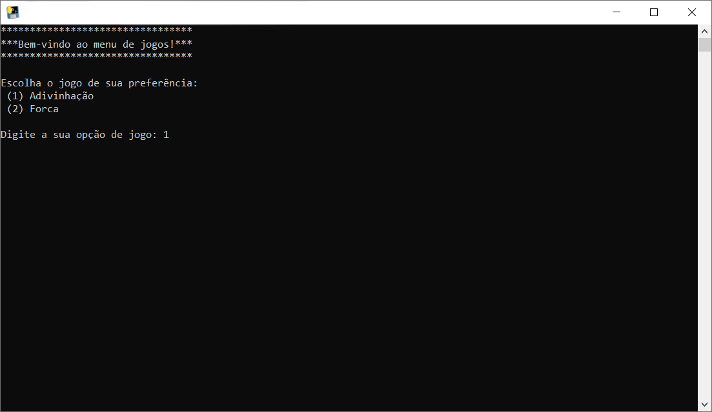
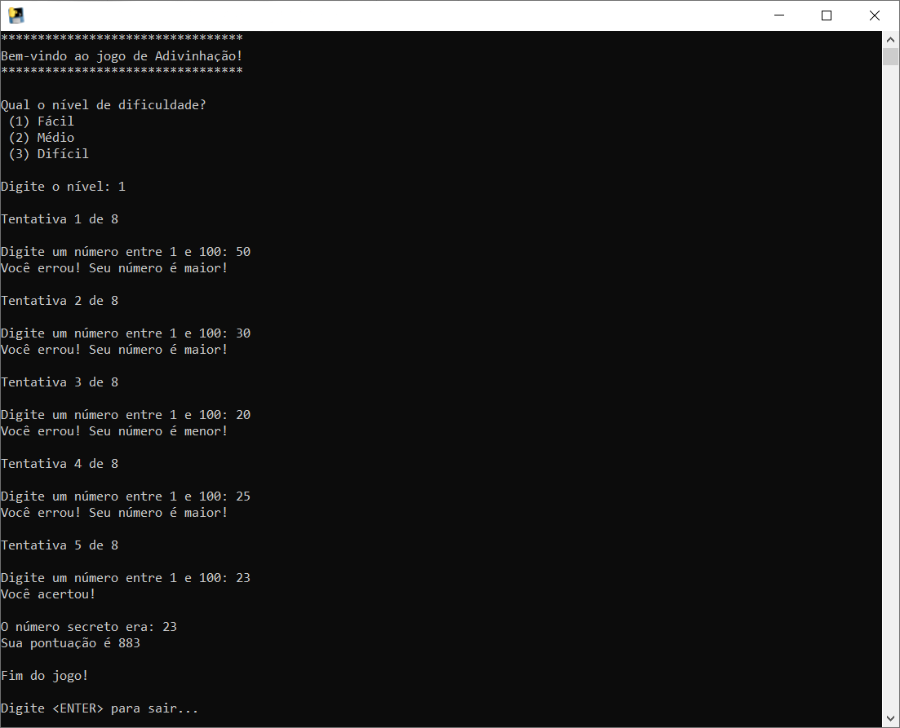
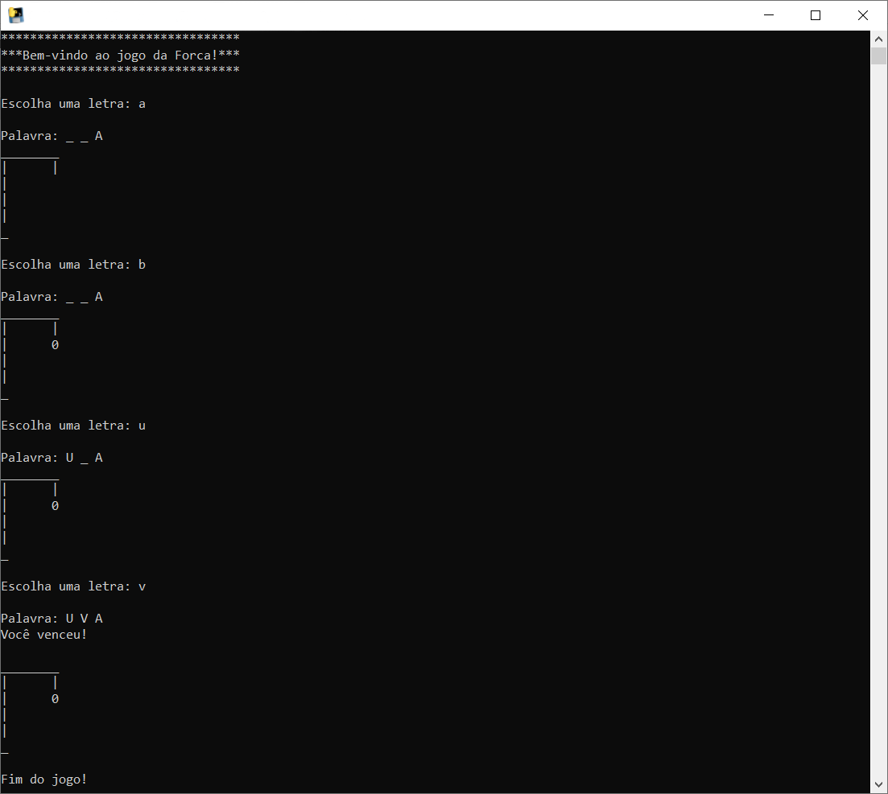

<h1 align="center">MultiGames em Python</h1>

Projeto multigames, onde possui um game de adivinhação de números e um jogo da forca.  Projeto de estudo para desenvolvimento em Python.

<h1 align="center">
  
</h1>

O projeto <b>MultiGames</b> foi desenvolvido em Python 3, com a orientação dos cursos <b><i>Python 3 parte 1: Introdução à nova versão da linguagem</i></b> e 
<b><i>Python 3 parte 2: Avançando na linguagem</i></b> da plataforma ALURA.
Esse projeto aborda operadores, condicionais, laços de repetição, manipulação de strings, estrutura de dados, importação de bibliotecas, escrita/leitura de arquivos
e boas práticas de programação.

 

 <table style="width:100%" border="0px">
  <tr>
    <td></td>
    <td></td>
  </tr>
</table> 

 
Executável para teste: ./dist/menu.exe
